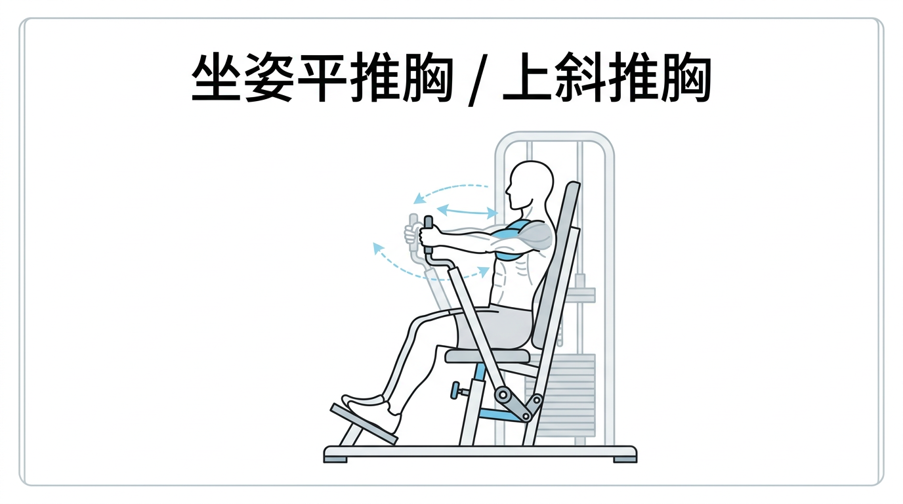
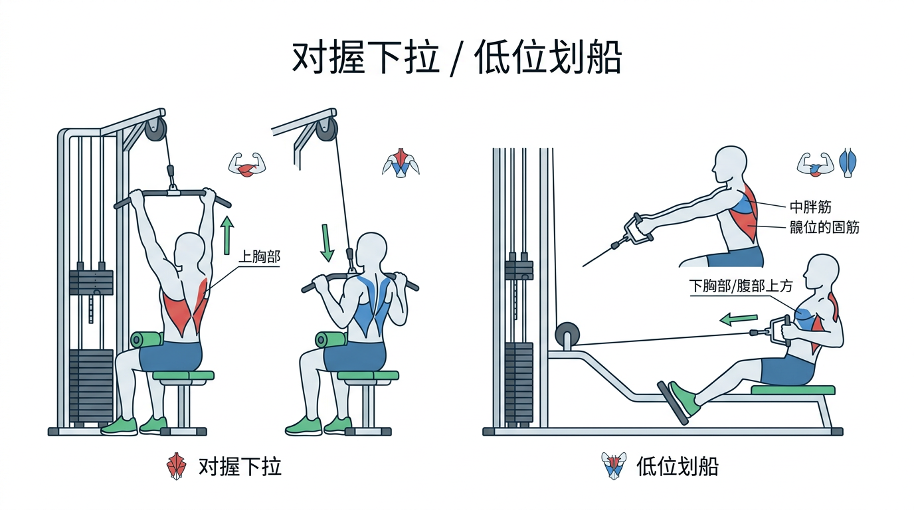
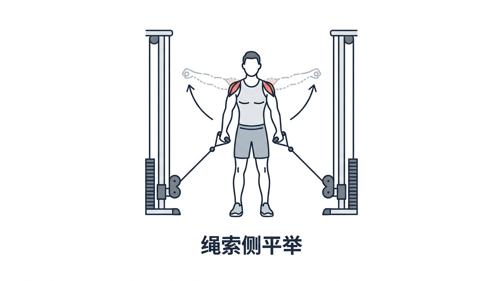
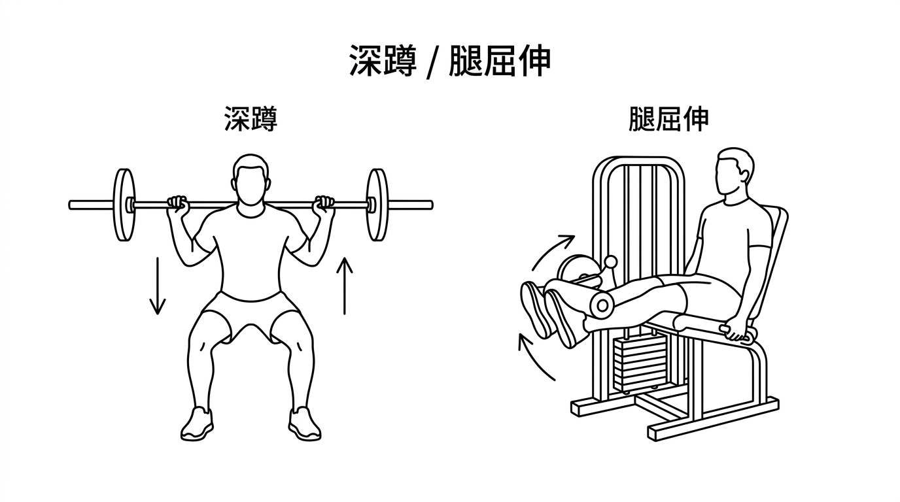
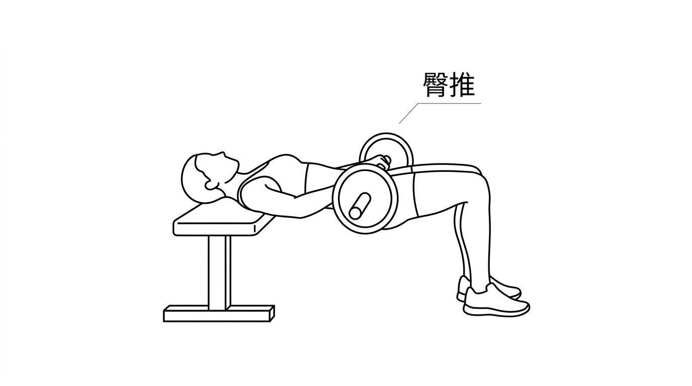
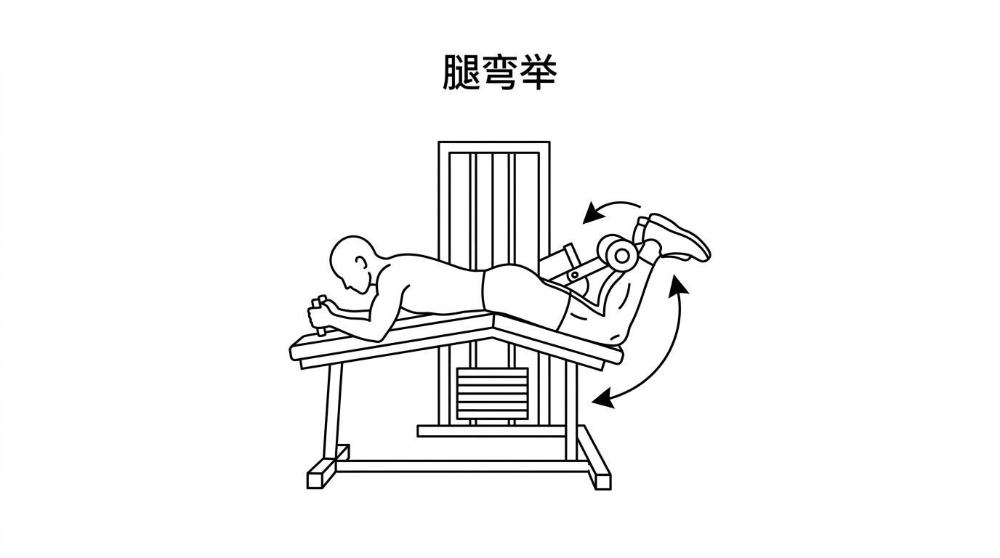

# 高尿酸专属·饮食补剂管理合集

## 目录

1. 每日饮食与补剂执行方案
2. 一周每日饮食清单
3. 饮食补剂采购清单
4. 锻炼计划
5. 训练动作（各部位统计）

## 一、每日饮食与补剂执行方案（高尿酸专属版）

### 🍳 早餐（固定配方）

- 基础搭配：60g🥣燕麦 + 2个🥚白煮蛋 + 1小盒**🥛无糖/零添加糖纯酸奶**（推荐提前一晚将燕麦加约150ml水拌匀后冷藏，早上直接食用）
- 可选添加（低糖控尿酸水果，三选一或少量混合，总量控制在50g左右）：
  - 半盒🫐蓝莓（少量摄入）
  - 少量🍓草莓（约4-5颗，小个为主）
  - 一小把🍒樱桃/车厘子（约8-10颗，樱桃对降低尿酸更友好，可优先选择）
- 蛋白强化：燕麦中加入**25g无添加糖纯酵母蛋白粉**（推荐怡可纳/概特）

### 🍗 午餐（肉类多选择+专属烹饪建议，等效2个去皮鸡腿≈150-180g）

- 主食：100g生米煮制🍚米饭
- 蛋白：任选其一（清淡烹饪，少油无高糖酱料）
  1. 🍗 2个去皮鸡腿：清煮/清蒸/少油煎（黑胡椒+少许盐）、清炖（撇浮油，只吃肉）
  2. 🍗 150g去皮鸡胸肉：水煮（蘸生抽/黑胡椒）、清蒸、少油快炒、鸡胸肉蒸蛋
  3. 🥩 100g瘦牛肉（牛里脊/牛腱子）：清炖、少油煎牛柳、水煮牛肉片（清淡汤底）
  4. 🥩 100g瘦猪肉（猪里脊/猪腱子）：清蒸肉片、少油炒肉丝、清煮肉条
  5. 🐟 150g巴沙鱼/龙利鱼：清蒸（生抽+葱花）、清煮鱼片、少油煎鱼块
- 🥬 蔬菜：炒青菜（芦笋/香菇+绿叶菜，种类多样化）

### 🥔 晚餐（肉类多选择+同品类烹饪，分量与午餐一致）

- 主食：200g根茎类（🥔土豆/🍠红薯/紫薯/芋头任选，优先紫薯）
- 蛋白：任选其一（含蛋类替代款）
  1. 上述午餐5类肉类（烹饪方式一致）
  2. 🥚 3个白煮蛋（极低嘌呤，纯蛋替代肉类蛋白）
- 🥬 蔬菜：无额外搭配，遵循午餐蔬菜多样化原则

### 🌙 睡前加餐（固定分量，坚果多选择替换）

- 30g**无添加糖纯酵母蛋白粉**（推荐与1小盒🥛无糖/零添加糖纯酸奶混合食用，口感更好、饱腹感更强）
- **15g🥜低嘌呤坚果（任选其一，均为高尿酸友好款）**
  1. 经典款：杏仁
  2. 替换款1：巴旦木（扁桃仁）
  3. 替换款2：开心果（无盐原味）
  4. 替换款3：腰果（原味，少盐）
  5. 替换款4：核桃（薄皮原味）

### 💊 补剂服用规范

| 补剂名称    | 推荐品牌  | 每日剂量         | 服用时间    | 尿酸友好性说明          |
| ------- | ----- | ------------ | ------- | ---------------- |
| 🐟 鱼油      | -     | 2粒           | 早1粒、晚1粒 | 低嘌呤，调节代谢，无尿酸影响   |
| 💊 辅酶Q10   | -     | 2粒           | 早1粒、晚1粒 | 纯营养素，无嘌呤，不影响尿酸代谢 |
| 🍊 维生素C    | 国药平价款 | 1000mg（约10粒） | 中午5粒、晚上5粒 | 促进尿酸溶解排泄，辅助控尿酸   |
| 💊 男士复合维生素 | GNC   | 1粒           | 早上      | 无高嘌呤成分，剂量合理      |
| 💊 甘氨酸镁    | -     | 1粒           | 睡前      | 低嘌呤，调节代谢，不影响尿酸排泄 |

### 📌 关键生活习惯（高尿酸强化版）

1. **💧 饮水量**：每日≥4L，晨起空腹500ml温水，可加🍋柠檬片/淡茶水/苏打水（弱碱性辅助溶尿酸）
2. **食材筛选**：全程规避添加糖/果葡糖浆、动物内脏、海鲜、浓肉汤/火锅汤；坚果选**原味、无盐/少盐款**，规避盐焗、蜜汁、奶油味坚果
3. **烹饪核心**：肉类去皮剔肥，优先清煮/清蒸/少油炒，调味仅用盐、黑胡椒、生抽、葱姜，规避高糖高嘌呤酱料
4. **蛋白原则**：坚持低嘌呤优质蛋白，禽类/瘦红肉/低嘌呤水产/鸡蛋/酵母蛋白为核心
5. **蔬菜原则**：所有新鲜蔬菜均可放心食用，保证菌菇类、绿叶类、根茎类多样化
6. **坚果食用原则**：每日固定15g分量（约10-15颗），低嘌呤坚果少量摄入无尿酸影响，避免过量导致热量超标

## 二、一周每日饮食清单（高尿酸专属，肉类+坚果双轮换+固定分量）

### 通用固定项（每日不变）

- **早餐**：60g🥣燕麦+2🥚白煮蛋+1小盒🥛无糖纯酸奶+半盒🫐蓝莓/少量🍓草莓/一小把🍒樱桃（三选一，低糖控尿酸水果，总量≈50g，加25g酵母蛋白粉）
- **睡前加餐**：30g酵母蛋白粉+**15g🥜低嘌呤坚果（每日轮换）**
- **午餐蔬菜**：🥬芦笋/香菇搭配任意绿叶菜（清炒）
- **晚餐主食**：200g根茎类（紫薯/🥔土豆/🍠红薯/芋头轮换）
- **💧 饮水量**：每日≥4L，晨起空腹500ml温水

### 每日定制餐单（肉类+坚果配套轮换）

#### 周一

- 早餐：60g🥣燕麦+2🥚白煮蛋+1小盒🥛无糖纯酸奶+半盒🫐蓝莓/少量🍓草莓/一小把🍒樱桃（三选一，总量≈50g，加25g酵母蛋白粉）
- 午餐：100g🍚米饭 + 🍗2个去皮鸡腿（清煮，黑胡椒+盐） + 🥬清炒芦笋+油麦菜
- 晚餐：200g🍠紫薯 + 🍗150g去皮鸡胸肉（水煮，蘸生抽）
- 睡前餐：30g酵母蛋白粉 + 15g🥜杏仁

#### 周二

- 早餐：60g🥣燕麦+2🥚白煮蛋+1小盒🥛无糖纯酸奶+半盒🫐蓝莓/少量🍓草莓/一小把🍒樱桃（三选一，总量≈50g，加25g酵母蛋白粉）
- 午餐：100g🍚米饭 + 🥩100g瘦牛肉（牛里脊，少油煎牛柳） + 🥬香菇炒菠菜
- 晚餐：200g🥔土豆 + 🐟150g巴沙鱼（清蒸，生抽+葱花）
- 睡前餐：30g酵母蛋白粉 + 15g🥜巴旦木

#### 周三

- 早餐：60g🥣燕麦+2🥚白煮蛋+1小盒🥛无糖纯酸奶+半盒🫐蓝莓/少量🍓草莓/一小把🍒樱桃（三选一，总量≈50g，加25g酵母蛋白粉）
- 午餐：100g🍚米饭 + 🍗150g去皮鸡胸肉（少油快炒配香菇） + 🥬清炒生菜+芦笋
- 晚餐：200g🍠红薯 + 🍗2个去皮鸡腿（清蒸，姜片调味）
- 睡前餐：30g酵母蛋白粉 + 15g🥜无盐原味开心果

#### 周四

- 早餐：60g🥣燕麦+2🥚白煮蛋+1小盒🥛无糖纯酸奶+半盒🫐蓝莓/少量🍓草莓/一小把🍒樱桃（三选一，总量≈50g，加25g酵母蛋白粉）
- 午餐：100g🍚米饭 + 🐟150g龙利鱼（少油煎鱼块） + 🥬香菇炒油麦菜
- 晚餐：200g芋头 + 🥩100g瘦猪肉（猪里脊，清蒸肉片）
- 睡前餐：30g酵母蛋白粉 + 15g🥜原味腰果

#### 周五

- 早餐：60g🥣燕麦+2🥚白煮蛋+1小盒🥛无糖纯酸奶+半盒🫐蓝莓/少量🍓草莓/一小把🍒樱桃（三选一，总量≈50g，加25g酵母蛋白粉）
- 午餐：100g🍚米饭 + 🥩100g瘦猪肉（猪腱子，少油炒肉丝配菠菜） + 🥬清炒芦笋+生菜
- 晚餐：200g🍠紫薯 + 🥩100g瘦牛肉（牛腱子，清炖撇浮油，仅吃肉）
- 睡前餐：30g酵母蛋白粉 + 15g🥜原味核桃

#### 周六

- 早餐：70g🥣燕麦+2🥚白煮蛋+1小盒🥛无糖纯酸奶+半盒🫐蓝莓/少量🍓草莓/一小把🍒樱桃（三选一，总量≈50g，加25g酵母蛋白粉）
- 午餐：120g🍚生米煮饭 + 🍗2个去皮鸡腿（清炖加姜片，不喝浓汤） + 🥬香菇+油麦菜清炒
- 练后餐：100g🍚生米煮饭 + 150g🥩瘦肉（牛肉/猪肉任选，清淡烹饪）
- 晚餐：250g🍠紫薯 + 🥩100g瘦牛肉（牛腱子，清炖撇浮油，仅吃肉）
- 睡前加餐：30g酵母蛋白粉 + 1根🍌香蕉（其余坚果可按需酌情减少或省略）

#### 周日

- 早餐：70g🥣燕麦 + 30g🥄蛋白粉 + 1个🥚全蛋 + 2个🥚蛋清
- 练前餐：100g🍚生米煮饭 + 2个🍗去皮鸡腿
- 练后餐：1根🍌香蕉 + 120g🍚生米煮饭 + 2个🍗去皮鸡腿
- 第四餐：300g🍜熟面条 + 150g🥩炒瘦肉
- 睡前餐：1个馒头 + 1个🍗去皮鸡腿

## 三、饮食补剂采购清单（高尿酸专属版，新增坚果多品类）

### 一、主食类

- 🥣 燕麦
- 🍚 大米
- 🥔 土豆 / 🍠 红薯 / 紫薯 / 芋头（任选，优先紫薯）

### 二、蛋白类

- 🥚 鸡蛋
- 🍗 鸡腿（去皮款优先）
- 🍗 去皮鸡胸肉
- 🥩 瘦牛肉（牛里脊/牛腱子，纯瘦无肥）
- 🥩 瘦猪肉（猪里脊/猪腱子，纯瘦无肥）
- 🐟 巴沙鱼/龙利鱼（无鳞淡水鱼，二选一即可）
- 🥄 蛋白粉（怡可纳/概特，**无添加糖纯酵母蛋白**款）
- 🥛 酸奶（小盒装，**无糖/零添加糖纯酸奶**）

### 三、蔬果坚果类

- 🫐 蓝莓 / 🍓 草莓 / 🍒 樱桃（低糖浆果类水果，少量轮换食用，更利于控制尿酸）
- 🥬 芦笋、香菇、各类绿叶菜（菠菜、油麦菜、生菜等）
- **🥜 低嘌呤坚果类（原味/无盐款，按需选购）**：杏仁、巴旦木、无盐原味开心果、原味腰果、原味核桃

### 四、补剂类

- 🐟 鱼油
- 💊 辅酶Q10
- 🍊 维生素C（国药平价款）
- 💊 男士复合维生素（GNC）
- 💊 甘氨酸镁

### 五、烹饪调味类（高尿酸友好款，少量）

- 🧂 食用盐（低钠盐优先）
- 🫙 生抽（无添加糖款）
- 🌿 黑胡椒
- 🫚 姜片、葱花

## 四、锻炼计划

### 工作日有氧（周二、周四）

- **有氧训练**：周二、周四各一次，每次 30 分钟
- **方式**：爬楼梯

### 周末（周六、周日）

- **周六**：
  1. **无氧**
     a. 胸：Newtech 坐姿平推胸；Panatta 插片上斜推胸（4组×15次）  
       要点：后背夹紧，肘抬平，肌肉拉开时吸气、收紧时吐气，手掌是推  
       
     b. 背：Newtech 对握下拉（背阔肌）；Panatta 低位划船（中上背）（4组×15次）  
       要点：要先吸气，然后开始做吐气的动作  
       
     c. 肩：绳索侧平举（3组×15次）  
       要点：身体前倾，不要转动  
       
  2. **有氧**
     a. 40 分钟爬楼机

- **周日**：
  1. **腿部热身**：髋内收
  2. **无氧**
     a. 大腿前：Panatta 深蹲；Panatta 腿屈伸（4组×15次）  
       要点：深蹲脚距略宽于肩，膝盖与脚尖同向；腿屈伸顶峰收缩、下放控制  
       
     b. 臀：Newtech 臀推（4组×15次）  
       要点：上背抵稳，顶髋至身体成一直线，顶峰收紧臀部  
       
     c. 大腿后：Panatta 腿弯举（4组×15次）  
       要点：髋贴紧垫面，勾脚背勾向臀部，下放控制不泄力  
       
  3. **有氧**
     a. 1 小时爬楼机

     
### 锻炼计划补充说明

- **分部位训练**：当前一周练2次，对应一次上半身训练、一次下半身训练，建议严格按照已有计划执行。
- **前期目标**：前12次锻炼（约一个半月）主要目标是熟悉动作、体会发力感，不要求大重量，关注动作标准与发力感受。
- **后期调整**：12次训练后（约2个月），可以逐步提高训练重量、组数或强度，促进入量提升和肌肉增长。
- **增加训练频率**：进入第2个月后，可以考虑在工作日自行增加第3次锻炼，针对任何感兴趣或想加强的部位，如手臂、核心或补充主力部位。训练方式灵活调整（器械/徒手皆可）。
- **训练建议**：建议定期记录训练内容和主观感受，2-3个月后根据适应情况适当调整动作、组数或分部位安排。

## 五、训练动作（各部位统计）

按部位汇总当前计划中涉及的所有训练动作，便于查阅与替换。

| 部位 | 动作名称 | 器械/方式 | 组数×次数 | 备注 |
| --- | --- | --- | --- | --- |
| **胸** | 坐姿平推胸 | Newtech | 4×15 | 后背夹紧，肘抬平，拉开吸气、收紧吐气 |
| **胸** | 插片上斜推胸 | Panatta | 4×15 | 同上，手掌是推 |
| **胸** | 哑铃推胸 | 哑铃 | 4×15 | 胸大肌 |
| **胸** | 蝴蝶机夹胸 | Panatta | 4×15 | 胸大肌 |
| **背** | 对握下拉（背阔肌） | Newtech | 4×15 | 背阔，先吸气再开始吐气动作 |
| **背** | 单臂绳索下拉 | 绳索 | 4×15 | 背阔 |
| **背** | 开肘划船（中上背） | Newtech | 4×15 | 中上背 |
| **背** | 低位划船（中上背） | Panatta | 4×15 | 同上 |
| **肩** | 绳索侧平举 | 绳索 | 3×15 | 肩中束，身体前倾，不要转动 |
| **腿部热身** | 髋内收 | - | 适量 | 周日无氧前热身 |
| **腿部** | 深蹲 | Panatta | 4×15 | 脚距略宽于肩，膝盖与脚尖同向 |
| **腿部** | 腿屈伸 | Panatta | 4×15 | 顶峰收缩、下放控制 |
| **腿部** | 腿弯举 | Panatta | 4×15 | 髋贴紧垫面，勾脚背勾向臀部，下放控制 |
| **臀** | 臀推 | Newtech | 4×15 | 上背抵稳，顶髋成一直线，顶峰收紧臀部 |
| **有氧** | 爬楼梯 | 楼梯/爬楼机 | 30 分钟（工作日）或 40 分钟～1 小时（周末） | 周二/周四 30 分钟；周六 40 分钟；周日 1 小时 |

- **上半身日（周六）**：胸 + 背 + 肩 → 有氧  
- **下半身日（周日）**：大腿前 + 臀 + 大腿后 → 有氧  
- 若日后增加手臂、核心等部位，可在此表中继续按部位追加动作。
